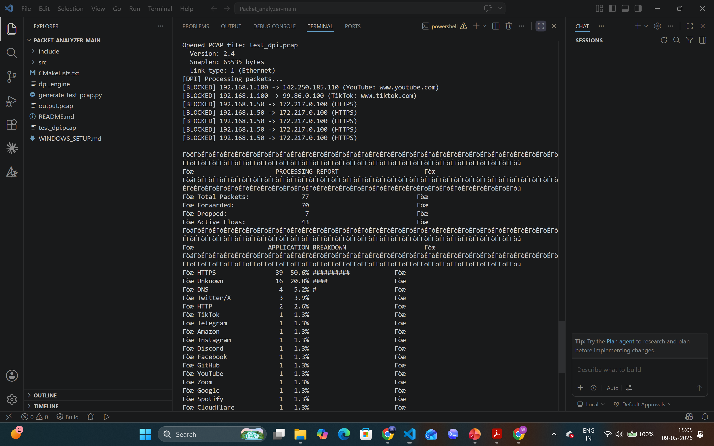

# DPI Engine — Deep Packet Inspection System


> A multithreaded C++17 network packet analyzer that performs deep packet inspection on PCAP captures — parses raw Ethernet/IP/TCP/TLS bytes, extracts SNI from HTTPS handshakes, tracks flows by 5-tuple, classifies 18+ applications, and enforces stateful blocking rules. Built without any external networking libraries.

---

## Demo



> Engine classifying 77 packets across 18 applications, blocking YouTube + TikTok by app name and 192.168.1.50 by IP — 7 packets dropped, 70 forwarded, output written to PCAP.

---

## Key Features

| Feature | Details |
|---|---|
| **Protocol Parsing** | Parses Ethernet → IP → TCP/UDP → TLS layers from raw bytes |
| **SNI Extraction** | Extracts domain from TLS Client Hello — works on HTTPS without decryption |
| **5-Tuple Flow Tracking** | Stateful connection tracking by Src IP, Dst IP, Src Port, Dst Port, Protocol |
| **Rule-Based Blocking** | Block by app name, IP address, or domain — enforced across entire flow |
| **18+ App Classification** | Identifies YouTube, TikTok, Facebook, Google, GitHub, Discord, Zoom, and more |
| **Multithreaded Architecture** | Producer-consumer design with configurable Load Balancer + Fast Path thread pools |
| **PCAP I/O** | Reads Wireshark captures, writes filtered output to new PCAP |
| **No External Libraries** | Pure C++17 stdlib + raw socket bytes — zero networking dependencies |

---

## Architecture

```
┌─────────────┐     ┌────────────────────────────────────────────┐     ┌─────────────┐
│  Input PCAP │────▶│                DPI Engine                  │────▶│ Output PCAP │
│ (Wireshark) │     │                                            │     │ (filtered)  │
└─────────────┘     │  [PCAP Reader]                             │     └─────────────┘
                    │       │
                    │       ▼
                    │  [Load Balancer Threads] ──▶ [Fast Path Threads]
                    │                                │
                    │                    ┌───────────┴──────────┐
                    │                    │ • Parse layers 2–7   │
                    │                    │ • Extract TLS SNI    │
                    │                    │ • Classify app       │
                    │                    │ • Check rules        │
                    │                    │ • FORWARD / DROP     │
                    │                    └──────────────────────┘
                    └────────────────────────────────────────────┘
```

### Two Versions

| Version | Entry Point | Use Case |
|---|---|---|
| Single-threaded | `src/main_working.cpp` | Learning / small captures |
| Multithreaded | `src/dpi_mt.cpp` | Production / large captures |

---

## How SNI Extraction Works

Even though HTTPS traffic is encrypted, the **TLS Client Hello** — the very first packet of every HTTPS connection — contains the destination domain in plaintext via the **SNI extension**:

```
TLS Client Hello
├── Version: TLS 1.2
├── Random: [32 bytes]
├── Cipher Suites: [list]
└── Extensions:
    └── SNI (type 0x0000):
        └── Server Name: "www.youtube.com"  ← extracted here
```

This is exactly how real-world ISPs, enterprise firewalls (Palo Alto, Cisco), and parental control systems identify and control application traffic — without breaking encryption.

---

## Flow Blocking Logic

Blocking is **stateful** — once a flow is flagged, every subsequent packet in that 5-tuple is dropped:

```
Packet 1  SYN                → flow unknown       → FORWARD
Packet 2  TLS Client Hello   → SNI: youtube.com   → RULE HIT → [BLOCKED]
Packet 3  TLS data           → same 5-tuple       → DROP
Packet 4+ ...                → same 5-tuple       → DROP
```

---

## Project Structure

```
network-dpi-engine/
├── include/
│   ├── packet_parser.h        # Ethernet/IP/TCP/UDP parsing
│   ├── sni_extractor.h        # TLS Client Hello SNI extraction
│   ├── connection_tracker.h   # 5-tuple flow state machine
│   ├── rule_manager.h         # App/IP/domain blocking rules
│   ├── load_balancer.h        # LB thread — flow distribution
│   ├── fast_path.h            # FP thread — packet processing
│   ├── thread_safe_queue.h    # Lock-based producer-consumer queue
│   └── types.h                # Core structs: FiveTuple, AppType, FlowState
│
├── src/
│   ├── main_working.cpp       # ★ Single-threaded entry point
│   ├── dpi_mt.cpp             # ★ Multithreaded entry point
│   ├── dpi_engine.cpp         # Engine orchestration
│   ├── sni_extractor.cpp      # TLS parsing implementation
│   ├── connection_tracker.cpp # Flow tracking implementation
│   └── [supporting modules]
│
├── generate_test_pcap.py      # Generates synthetic test traffic
└── CMakeLists.txt
```

---

## Build & Run

### Prerequisites

- **Linux / macOS** — `g++` or `clang++` with C++17
- **Windows** — MinGW-w64 (GCC 16+) via [winlibs.com](https://winlibs.com)
- No external libraries required

### Build

**Single-threaded (Windows / Linux / macOS):**
```bash
g++ -std=c++17 -O2 -I include -o dpi_simple.exe \
    src/main_working.cpp src/pcap_reader.cpp \
    src/packet_parser.cpp src/sni_extractor.cpp src/types.cpp
```

**Multithreaded (Linux / macOS):**
```bash
g++ -std=c++17 -pthread -O2 -I include -o dpi_engine \
    src/dpi_mt.cpp src/pcap_reader.cpp \
    src/packet_parser.cpp src/sni_extractor.cpp src/types.cpp
```

### Run

```bash
# Step 1 — generate synthetic test traffic
python3 generate_test_pcap.py

# Step 2 — basic run
./dpi_simple.exe test_dpi.pcap output.pcap

# Step 3 — with blocking rules
./dpi_simple.exe test_dpi.pcap output.pcap \
    --block-app YouTube \
    --block-app TikTok \
    --block-ip 192.168.1.50

# Multithreaded with custom thread pool
./dpi_engine input.pcap output.pcap --lbs 4 --fps 4
```

---

## Results (on synthetic test capture)

| Metric | Value |
|---|---|
| Total packets processed | 77 |
| Applications classified | 18 |
| Packets forwarded | 70 |
| Packets dropped (blocked) | 7 |
| Active flows tracked | 43 |
| TLS SNIs extracted | 16 |
| Protocols detected | HTTPS, HTTP, DNS, TLS |

---

## What This Demonstrates

- **Systems Programming** — raw byte-level protocol parsing in C++ with no external libraries
- **Computer Networking** — practical OSI layer 2–7 implementation (Ethernet, IP, TCP, TLS)
- **Security Engineering** — TLS handshake internals, SNI-based traffic classification
- **Concurrency** — producer-consumer thread pool with thread-safe queue and configurable parallelism
- **Data Structures** — hash-map based 5-tuple flow table for O(1) connection lookup

---

## Author

**Writick Parui** · [LinkedIn](https://linkedin.com/in/writick-parui099) · [GitHub](https://github.com/writickp3-ctrl)

> M.E. Computer Science @ Thapar Institute of Engineering & Technology | GATE 2025 Qualified
